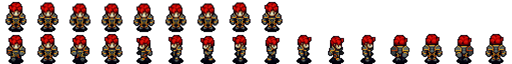




<center></center> 
## OpenRPG 


#### OpenRPG Directory 
    ├── Debug
    ├── Document
    ├── Examples
    ├── External
    │   └── SFML    
    ├── Image
    └── OpenRPG
        ├── Components
        ├── Config
        ├── Debug
        │   └── OpenRPG.tlog
        ├── Entities
        ├── Fonts
        ├── GUI
        ├── Game
        ├── Managers
        ├── Maps
        ├── Release
        │   └── OpenRPG.tlog
        ├── Resources
        │   ├── image
        │   │   ├── Backgrounds
        │   │   ├── Buttons
        │   │   └── Sprites
        │   │       └── Player       
        │   ├── map
        │   └── sound
        ├── States
        │   ├── Editor
        │   ├── Game
        │   ├── MainMenu
        │   └── Settings
        └── Tiles
    
## 👏How to Contribute
 
- 오픈월드RPG게임을 만듭니다.
- README.md 를 이쁘게 꾸며주셔도 좋습니다..ㅎ (영어번역환영) 
- 오타 교정
- 버그 제보
- 기능 제안 및 추가 
- 커뮤니티 [Slack링크](https://join.slack.com/t/openrpgworkspace/shared_invite/enQtNzExMDI5NDg3MTU1LWFhMmNkMGM1YzQ3ZmUzZWYxNTkwYzYzM2UwOGMxOTkxYWVjNjE1MWM5NTNjYWQ1OWIwNzM2NTE3Zjc4Y2RjMzE) 
 ***
    
## 📋 Requirements 
  
- SFML, ImGUI, Visual Studio 2017, Windows10
- 윈도우환경에서만 테스트해봤습니다. 
- SFML라이브러리 추가방법 https://www.sfml-dev.org/tutorials/2.5/start-vc.php
- 속성시트추가완료. 32bit환경입니다. x86 
 
## 1차 업데이트 
<center></center> 
- 메인화면추가, 텍스쳐처리 완료 
 
## 2차 업데이트 
<center></center> 
- 메인화면업데이트, 버튼 텍스쳐처리완료, 히트박스시스템추가, 애니메이션 기능 추가 

## 3차 업데이트 
<center></center> 
- 에디터기능 추가, 일시정지기능 추가, 사운드매니저 추가 및 bgm적용, 설정화면 추가 및 기능 구현

## 4차 업데이트 
<center></center> 
- 텍스처교체, Enemy구현, Player GUI추가, 버그 수정 및 코드리펙토링
 
## 엔진 설명서
- 장면(state scene) 추가 
```
새로운 장면을 추가하기 위해서 State클래스를 상속하여 새로운 클래스를 추가해야합니다. 
State클래스는 각 state들을 states스택에 저장하도록 만들어져있습니다.  
게임에서 다음장면으로 넘어갈려면 이 스택에 장면을 추가해야합니다. 
endState()를 호출하면 해당 state는 스택에서 pop되어 삭제되며, pauseState를 호출하면 해당장면을 일시정지합니다. 
순수가상함수로는 update함수들이 있으며 새로운 장면을 추가할 때, 장면에 맞게 이 가상함수들을 꼭 구현해주어야합니다. 
onActivated, onDeactivated, onEnter, onLeave 는 이름에 맞게
 장면의 상태(위치)에따라 호출되는 함수로 주로 배경음악을 재생하거나, 
연출을 넣을 때 사용하는 함수입니다.  
장면들은 StateManager를 통해 관리되도록 만들어졌으며, 싱글턴으로 구현되어 있습니다. 
장면을 추가할려면 이 싱글턴객체를 가져와 스택에 push해주면 됩니다.
```
예시코드) 
```C
//MainMenuState.cpp
//설정화면버튼이 Pressed면 SettingsState객체를 만들어 스택에 추가합니다. 
if (this->buttons["SETTING_STATE"]->isPressed()) {
		StateManager::getInstance()->Push(new SettingsState(this->stateData));
}

// 종료버튼이 Pressed면 endState()를 호출하여 현재 장면을 제거합니다. 스택에 남은 장면이 없으면 게임이 종료됩니다.    
if (this->buttons["EXIT_STATE"]->isPressed()) {
		this->endState();
}
``` 

- 새로운 장면클래스 만들기 
```
게임에는 여러 장면이 있을 수 있습니다. 사냥터, 던전, 마을 등 각 장면을 추가하기 위해서는 
해당 장면에 맞는 클래스를 만들어야합니다.
```  
 
```C++
class GameState :
	public State
{
private:
//Variables 각 리소스들을 담을 변수를 선언합니다.
   sf::View view;
   sf::RenderTexture renderTexture;
   ...
//Functions 변수들을 초기화하는 함수들은 이곳에 선언합니다. 
	void initDeferredRender();
public:
    //생성자와 소멸자
    GameState(StateData* state_data);
	virtual ~GameState();

	//Functions 동적으로 처리하기위한 업데이트함수들을 이곳에 선언합니다.
	void updateView(const float& dt);
	void updateInput(const float& dt);
}
```
자세한 구현내용은 실제코드를 확인하시면 됩니다. 

- 장면에 음악 추가하기 
```장면에 음악을 추가하는 방법은 SoundManager를 이용하면됩니다. 
SoundManager는 SoundComponent들을 관리하며 음량조절, 정지, 재생등의 
기능을 가지고 있습니다. 현재 이 프로젝트에서는 메인메뉴장면이 최상단에 위치할 때 마다, 
음악이 재생되도록 구현되어있습니다. 
```
```C++
//State.cpp
void State::initSounds() {
	if (!this->sounds["BACKGROUND_MUSIC"].loadFromFile("Resources/sound/bgm.ogg")) { //음악파일 
		throw "ERROR::GAME_STATE::COULD_NOT_LOAD_BGM";
	}
	else
	{
		atexit(destroy);
	}
}

//MainMenuState.cpp
// 메인 화면이 표시될 때 BGM 재생
void MainMenuState::onActivated() {
	this->background.setFillColor(sf::Color(255.f, 255.f, 255.f, this->backGroundColor));
	auto sm = SoundManager::getInstance(); //사운드매니저 객체를 가져옵니다.
	sm->LoadBGM(sounds["BACKGROUND_MUSIC"]); //map자료구조에 매핑된 "BACKGROUND_MUSIC"을 가져옵니다. 
	sm->getBGM()->setLoop(true)->play();  //재생합니다. 
}
```

- 객체(Object, Entity 만들기) 
```
게임내에서 움직이는 객체를 만들려면 Entity객체를 상속받아 만들거나, 새로운 객체클래스를 
만들어 특성에 맞도록 Component를 추가해주면됩니다. 
현재 개발된 컴포넌트는 HitBox(충돌), Sound, Movement, Animation, Skill 이 있습니다. 
객체를 움직이기위해서는 MovementComponent를 반드시 추가해야합니다.
```
```C++
//Player.cpp  Player클래스의 생성자.
Player::Player(float x, float y, sf::Texture& texture_sheet)
{
	this->initVariables();
    
    //(스프라이트, offset_x, offset_y, 넓이, 높이)
    //히트박스가 캐릭터에 알맞게 위치하도록 offset을 조정합니다. 넓이와 높이는 히트박스의 크기입니다.)
	this->createHitboxComponent(this->sprite, 12.f, 10.f, 40.f, 54.f);  
    
    // 가속력, 최대속력, 감속속도 입니다.
	this->createMovementComponent(3000.f, 4000.f, 1000.f);
    
    //에니메이션 컴포넌트는 texture_sheet를 넣어주어야하며, 애니메이션에관한 코드는 아래에서 설명하겠습니다.
	this->createAnimationComponent(texture_sheet);
	this->createAttributeComponent(1);
	this->createSkillComponent();

	this->setPosition(x, y);
	this->initAnimations();
}
``` 
- 애니메이션 만들기 
```애니메이션을 재생하기위해서는 스프라이트 택스쳐가 준비되어있어야합니다. ```
 
```C++
//Player 객체의 애니메이션
void Player::initAnimations()
{
	this->animationComponent->addAnimation("IDLE", 15.f, 0, 0, 8, 0, 64, 64);
	this->animationComponent->addAnimation("WALK_LEFT",  3.f,   4,  1,    7,  1,   64, 64);
	this->animationComponent->addAnimation("WALK_DOWN",  3.f,   0,  1,    3,  1,   64, 64);
	this->animationComponent->addAnimation("WALK_RIGHT", 3.f,   8,  1,   11,  1,   64, 64);
	this->animationComponent->addAnimation("WALK_UP",    3.f,   12, 1,   15,  1,   64, 64);
	this->animationComponent->addAnimation("ATTACK",     5.f,   0,  2,    1,  2,   64, 64);
}
```
addAnimation함수로 애니메이션을 추가할 수 있으며, map자료구조로 매핑하여 사용합니다. 
인자는 키값, 재생주기(짧을수록 재생속도가빨라집니다.)  스프라이트에서 시작위치, 스프라이트에서 끝나는위치, 프레임크기(x,y) 
"IDLE"을 기준으로 15.f의 속도로 재생됩니다. IDLE의 시작위치는 위에 플레이어 SHEET에서 0,0 번째부터 8,0번째임을 알수있습니다. 

 
## 주요 개발 일지 
- 19년 8월 1일   프로젝트 개발 계획 수립 
- 19년 8월 8일   프로젝트폴더구성, 라이브러리 설치, 빌드환경 구성 
- 19년 8월 9일   OpenRPG github 오픈, 게임엔진개발 시작 
- 19년 8월 10일 프로젝트에 쉽게 접근할수있도록 속성시트제작 및 Game클래스 설계 
- 19년 8월 11일 캐릭터 생성 및 이동구현 
- 19년 8월 12일 메뉴화면 개발 및 Button클래스작성하여 장면이동기능 구현 
- 19년 8월 13일 텍스쳐기능추가 및 케릭터애니메이션클래스를 제작하여 움직이는 캐릭터 구현 
- 19년 8월 14일 상하좌우이동 애니메이션구현, Editor클래스제작 및 에디터제작 준비 
- 19년 8월 15일 Hitbox생성 및 적용완료.
- 19년 8월 16일 메뉴화면텍스처변경 및 디자인수정, 버튼클래스 텍스처적용가능하도록 수정
- 19년 8월 17일 게임플레이도중 일시정지 및 메뉴화면 팝업기능 구현
- 19년 8월 18일 SoundComponent제작 및 배경음악 적용완료(X-rated-Curse님이 기여해주셨습니다.)
- 19년 8월 19일 긴급이슈사항들 처리 (버그 위주로 픽스, 포커스가 아닌 상태에서 키입력 외 2가지) 
- 19년 8월 20일
   - WolfgangKurz님의 컨트리뷰트로 엔진디자인 수정. 이제 State는 매니저에 의해 관리됩니다. 
   - SoundManager,StateManger추가, 및 Game 싱글턴으로 구조변경. 
   - DropDownList GUI가 추가되었습니다. Button클래스파일들은 Gui.h로 변경되었고,
      이제 gui::namespace로 관리합니다. 
- 19년 8월 21일 설정화면 기능추가 --> 해상도조절이 가능해졌습니다.  타일맵 작업진행 시작 
- 19년 8월 22일 타일맵셀렉터기능 추가, 에디터에서 맵수정이 가능하도록 기능 구현 중 
- 19년 8월 24일 타일맵을 고르고 입력이 가능하도록 업데이트되었습니다. 
- 19년 8월 26일 타일맵 숨김 기능 추가, 사이드바 제작 
- 19년 8월 27일 타일맵 저장 & 불러오기 기능 구현완료 및 게임스테이트에 적용구현완료 
- 19년 8월 31일 카메라 이동 구현 완료 
- 19년 9월 1일  케릭터하이라이트 쉐이더추가(밤, 동굴효과)
- 19년 9월 2일  아이템 클래스추가 , PlayerGui 추가. skillComponent추가(미구현)
- 19년 9월 3일  모드추가 및 에디터모드로 분리.
- 19년 9월 4일  각 파일에 맞게 폴더정리 및 코드 정리
- 19년 9월 10일 문서작성 
