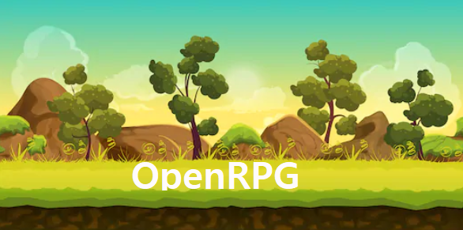
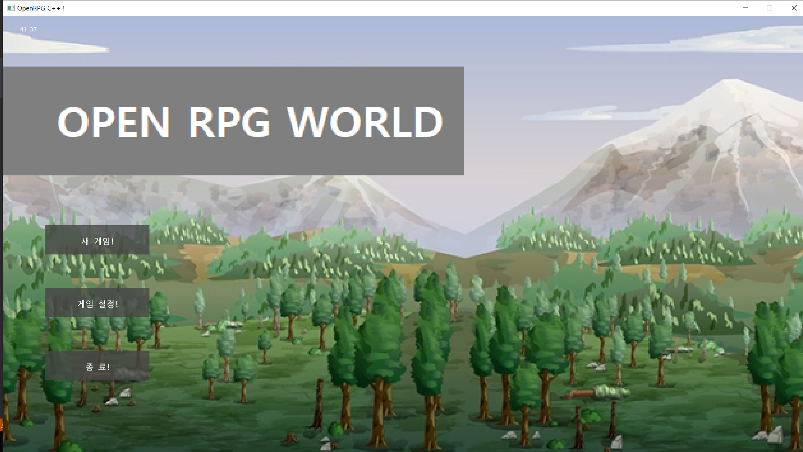
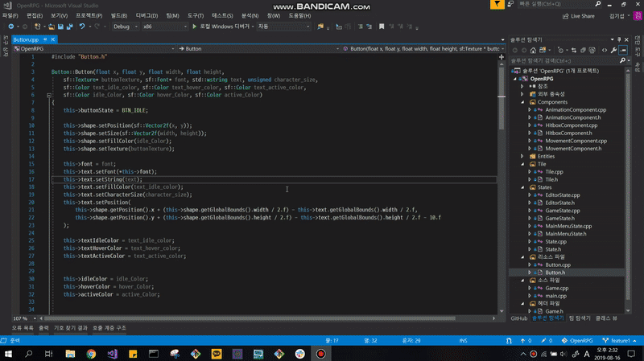



 
 
 
## OpenRPG 

#### OpenRPG Directory 
    ├── Debug
    ├── Document
    ├── Examples
    ├── External
    │   └── SFML    
    ├── Image
    └── OpenRPG
        ├── Components
        ├── Config
        ├── Debug
        │   └── OpenRPG.tlog
        ├── Entities
        ├── Fonts
        ├── GUI
        ├── Game
        ├── Managers
        ├── Maps
        ├── Release
        │   └── OpenRPG.tlog
        ├── Resources
        │   ├── image
        │   │   ├── Backgrounds
        │   │   ├── Buttons
        │   │   └── Sprites
        │   │       └── Player       
        │   ├── map
        │   └── sound
        ├── States
        │   ├── Editor
        │   ├── Game
        │   ├── MainMenu
        │   └── Settings
        └── Tiles
    
## 👏How to Contribute
 
- 오픈월드RPG게임을 만듭니다.
- README.md 를 이쁘게 꾸며주셔도 좋습니다..ㅎ (영어번역환영) 
- 오타 교정
- 버그 제보
- 기능 제안 및 추가 
- 커뮤니티 [Slack링크](https://join.slack.com/t/openrpgworkspace/shared_invite/enQtNzExMDI5NDg3MTU1LWFhMmNkMGM1YzQ3ZmUzZWYxNTkwYzYzM2UwOGMxOTkxYWVjNjE1MWM5NTNjYWQ1OWIwNzM2NTE3Zjc4Y2RjMzE) 
 ***
    
## 📋 Requirements 
  
- SFML, ImGUI, Visual Studio 2017, Windows10
- 윈도우환경에서만 테스트해봤습니다. 
- SFML라이브러리 추가방법 https://www.sfml-dev.org/tutorials/2.5/start-vc.php
- 속성시트추가완료. 32bit환경입니다. x86 
 
## 1차 업데이트 

 
- 메인화면추가, 텍스쳐처리 완료 
 
## 2차 업데이트 

- 메인화면업데이트, 버튼 텍스쳐처리완료, 히트박스시스템추가, 애니메이션 기능 추가 

## 3차 업데이트 

- 에디터기능 추가, 일시정지기능 추가, 사운드매니저 추가 및 bgm적용, 설정화면 추가 및 기능 구현
 
## 주요 개발 일지 
- 19년 8월 1일   프로젝트 개발 계획 수립 
- 19년 8월 8일   프로젝트폴더구성, 라이브러리 설치, 빌드환경 구성 
- 19년 8월 9일   OpenRPG github 오픈, 게임엔진개발 시작 
- 19년 8월 10일 프로젝트에 쉽게 접근할수있도록 속성시트제작 및 Game클래스 설계 
- 19년 8월 11일 캐릭터 생성 및 이동구현 
- 19년 8월 12일 메뉴화면 개발 및 Button클래스작성하여 장면이동기능 구현 
- 19년 8월 13일 텍스쳐기능추가 및 케릭터애니메이션클래스를 제작하여 움직이는 캐릭터 구현 
- 19년 8월 14일 상하좌우이동 애니메이션구현, Editor클래스제작 및 에디터제작 준비 
- 19년 8월 15일 Hitbox생성 및 적용완료.
- 19년 8월 16일 메뉴화면텍스처변경 및 디자인수정, 버튼클래스 텍스처적용가능하도록 수정
- 19년 8월 17일 게임플레이도중 일시정지 및 메뉴화면 팝업기능 구현
- 19년 8월 18일 SoundComponent제작 및 배경음악 적용완료(X-rated-Curse님이 기여해주셨습니다.)
- 19년 8월 19일 긴급이슈사항들 처리 (버그 위주로 픽스, 포커스가 아닌 상태에서 키입력 외 2가지) 
- 19년 8월 20일
   - WolfgangKurz님의 컨트리뷰트로 엔진디자인 수정. 이제 State는 매니저에 의해 관리됩니다. 
   - SoundManager,StateManger추가, 및 Game 싱글턴으로 구조변경. 
   - DropDownList GUI가 추가되었습니다. Button클래스파일들은 Gui.h로 변경되었고,
      이제 gui::namespace로 관리합니다. 
- 19년 8월 21일 설정화면 기능추가 --> 해상도조절이 가능해졌습니다.  타일맵 작업진행 시작 
- 19년 8월 22일 타일맵셀렉터기능 추가, 에디터에서 맵수정이 가능하도록 기능 구현 중 
- 19년 8월 24일 타일맵을 고르고 입력이 가능하도록 업데이트되었습니다. 
